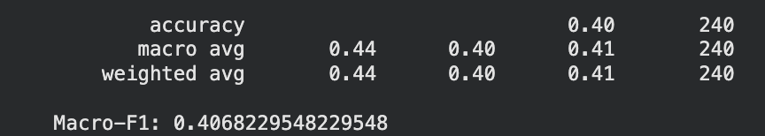
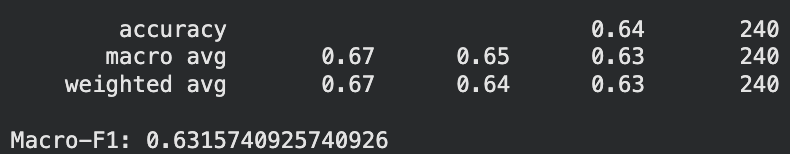

# Pr_9 CEG3004 Project 

## Overview
This project implements a machine learning pipeline designed to categorize environmental audio into 50 classes. Leveraging a training set of 1,200 labeled `.wav` files, the system evaluates unseen audio data and is explicitly tested for resilience against real-world acoustic distortions, including noise injection and band-limiting.

## Prerequisites
Dependencies can be installed with:
```
pip install numpy scipy pandas scikit-learn librosa soundfile tqdm gdown joblib
```


## DSP Pipeline
Below are the steps taken to improve the pipeline for classification tasks and the rationale behind them.

### Section 5: Audio Preprocessing
#### 1. Mean Centering
```python
y = y - np.mean(y)
```
**Rationale:** Removes hardware-induced DC offset by centering the waveform at zero, preventing energy distortion during subsequent feature extraction.

#### 2. Pre-emphasis Filter
```python
y = librosa.effects.preemphasis(y, coef=0.97)
```
**Rationale:** Boosts higher frequencies to highlight critical environmental textures and transients (e.g., breaking glass, rain) that might otherwise be overshadowed by low-frequency background noise.

#### 3. Fixed-Length Padding and Truncation
```python
target_samples = int(5.0 * sr)
y = librosa.util.fix_length(y, size=target_samples)
```
**Rationale:** Guarantees uniform tensor shapes for the model by forcing every clip to exactly 5.0 seconds. It truncates longer clips and pads shorter ones with silence, acting as a safety net against minor resampling discrepancies.

#### 4. Peak Normalization
```python
y = librosa.util.normalize(y)
```
**Rationale:** Scales the maximum amplitude to `1.0`. This standardizes the volume across the diverse ESC-50 dataset, forcing the model to learn true acoustic patterns (timbre, frequency) rather than relying on raw recording loudness.

The sequence of these preprocessing steps is highly intentional. Executing them out of order introduces mathematical artifacts and undermines the integrity of the data passed to the model.

### Section 6: Feature Extraction

#### 1. Robust Statistical Pooling (`pooled_stats`)
```python
def pooled_stats(M):
    return np.concatenate([
        M.mean(axis=1),
        M.std(axis=1),
        np.median(M, axis=1),
        np.percentile(M, 25, axis=1),
        np.percentile(M, 75, axis=1),
    ], axis=0)
```
**Rationale:** Standard statistical summaries (mean and standard deviation) are highly sensitive to sudden, loud outliers—which are very common in environmental audio (e.g., a glass breaking or a dog bark). Medians and quartiles are robust to these extreme outliers, providing the model with a much more stable and reliable numerical "footprint" of the sound's overall texture.

#### 2. Log-Mel Spectrogram (`feat_logmel`)
```python
mel = librosa.feature.melspectrogram(y=y, sr=sr, n_fft=1024, hop_length=256, n_mels=48)
logmel = librosa.power_to_db(mel + 1e-10, ref=np.max)
feat_logmel = pooled_stats(logmel)
```
**Rationale:** This creates a dense, high-resolution map of energy distributed across human-perceivable frequency bands. It is highly effective for capturing continuous, textured background sounds like rain, wind, or a running engine.

#### 3. Comprehensive Spectral Descriptors (`feat_spec`)
```python
centroid = librosa.feature.spectral_centroid(y=y, sr=sr, n_fft=1024, hop_length=256)
bandwidth = librosa.feature.spectral_bandwidth(y=y, sr=sr, n_fft=1024, hop_length=256)
rolloff = librosa.feature.spectral_rolloff(y=y, sr=sr, n_fft=1024, hop_length=256)
contrast = librosa.feature.spectral_contrast(y=y, sr=sr, n_fft=1024, hop_length=256)
flatness = librosa.feature.spectral_flatness(y=y, n_fft=1024, hop_length=256)
zcr = librosa.feature.zero_crossing_rate(y, hop_length=256)

S = np.abs(librosa.stft(y, n_fft=1024, hop_length=256))
flux = np.sqrt(np.sum(np.diff(S, axis=1)**2, axis=0, keepdims=True))

feat_spec = np.concatenate([
    pooled_stats(centroid),
    pooled_stats(bandwidth),
    pooled_stats(rolloff),
    pooled_stats(contrast),
    pooled_stats(flatness),
    pooled_stats(zcr),
    pooled_stats(flux),
], axis=0)
```
**Rationale:** Extracting these seven distinct physical acoustic properties gives the model a multi-dimensional understanding of the audio:
  * **Spectral Centroid & Bandwidth:** Measures the "center of mass" and "width" of the frequencies (distinguishes bright/high-pitched sounds from deep/low-pitched ones).
  * **Spectral Rolloff:** Identifies the frequency below which the vast majority of the audio energy is concentrated.
  * **Spectral Contrast:** Measures the difference between peaks and valleys in the spectrum (helps separate clear, resonant tones from broadband noise).
  * **Spectral Flatness & Zero-Crossing Rate (ZCR):** Quantifies how noisy, crackly, or percussive a signal is.
  * **Spectral Flux:** Calculates how quickly the power spectrum changes from frame to frame. This is critical for detecting sudden impacts or rhythmic events like footsteps or knocking.

### Section 8 (Model Training)

We train a linear classification model on the extracted 1D feature vectors to predict the environmental sound class.

#### 1. Data Splitting
* **80/20 Split:** The dataset is divided into training and validation sets.
* **Stratified:** We use `stratify=y` to guarantee both sets maintain the exact class proportions of the ESC-50 dataset.

#### 2. Model Pipeline
We use a `scikit-learn` Pipeline combining feature scaling and a Support Vector Machine (SVM):
```python
model = Pipeline([
    ('scaler', StandardScaler()),
    ('clf', SVC(kernel='linear', C=10.0, class_weight='balanced'))
])
```
* **`StandardScaler`:** Normalizes our diverse features (MFCCs, Log-Mel, descriptors) to a mean of 0 and variance of 1. This prevents features with naturally larger numerical values from dominating the SVM's distance calculations.
* **Linear Kernel:** Highly efficient and effective because our concatenated, multi-faceted feature space is extremely high-dimensional and likely linearly separable.
* **`C=10.0`:** A stricter penalty for misclassifications. This forces the model to draw more precise boundaries between acoustically similar environments.
* **Balanced Weights:** Automatically adjusts for any slight class imbalances in the training subset.

## Results
| Baseline Pipeline | Our Improved Pipeline |
| :---: | :---: |
|  |  |

As a comparison, the macro F1 score of the baseline classification pipeline is ~0.4068, whereas our improved pipeline achieved a macro F1 score of ~0.6315.

## How to Run on Google Colab (Recommended)

This project is optimized to run on `Google Colab`, which provides a free, cloud-based Jupyter notebook environment. No local setup or installation is required!

### Step 1: Open the Notebook in Colab
1. Download `CEG3004_Project_Colab_Pr_9.ipynb` notebook in this GitHub repo.
2. Navigate to [Google Colab](https://colab.research.google.com/).
3. Upload the downloaded notebook to Colab via the **Upload** tab.

### Step 2: Run the Setup Cells
Once the notebook is open, click the **"Run"** button (play icon) next to each cell sequentially, or press `Shift + Enter`.
* Run the **Setup** cell to install all required libraries.

### Step 3: Get the Dataset
The notebook includes a cell that attempts to automatically download and extract the dataset using `gdown`. Run this cell.

> ** Troubleshooting the Download (Rate Limits):** > Because the file is hosted on Google Drive, you might encounter a `FileURLRetrievalError` ("Too many users have viewed or downloaded this file recently"). If this happens:
> 1. Manually download the `CEG3004_Project_Data.zip` file using the link provided in the notebook.
> 2. On the left sidebar of Google Colab, click the **Folder icon** (Files).
> 3. Click the **Upload** icon (page with an up arrow) and upload the `.zip` file directly to the Colab workspace.
> 4. Run the extraction cell to unzip the data.

### Step 4: Run the DSP Pipeline & Model
Continue running the cells sequentially from top to bottom. 
* The **Interactive Audio Player** will render directly in the notebook, allowing you to listen to samples and view waveforms/spectrograms.
* The feature extraction step may take a few minutes to process all 1,200 audio files.

### Step 5: Download Your Results
In the final steps of the notebook, the script will train the model and generate predictions. Colab will automatically trigger a browser download for two files:
1. `Pr_9_model.joblib`: trained model
2. `Pr_9_predictions.csv`: predictions on validation set
